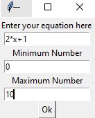
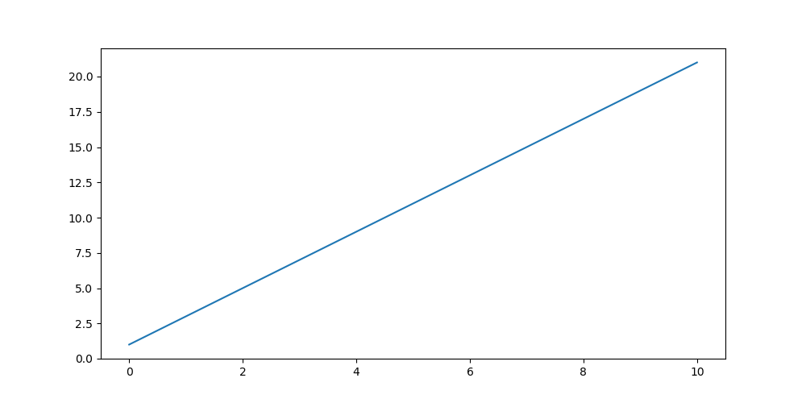
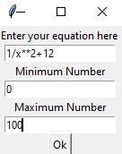
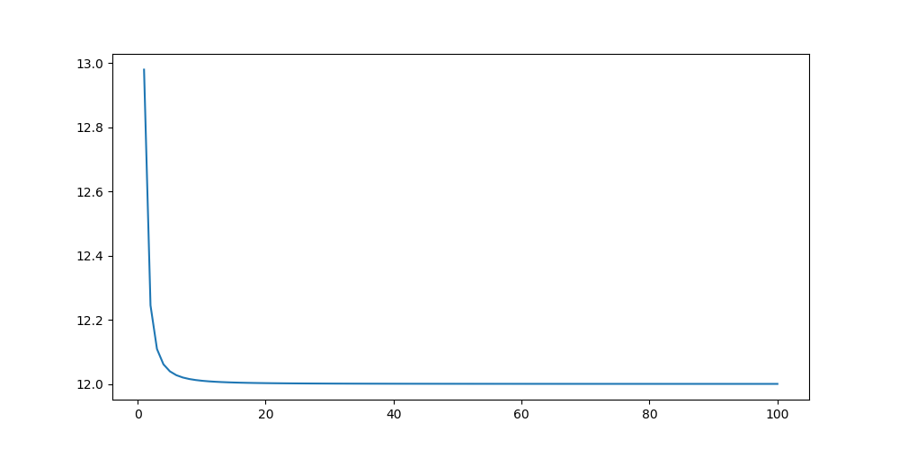
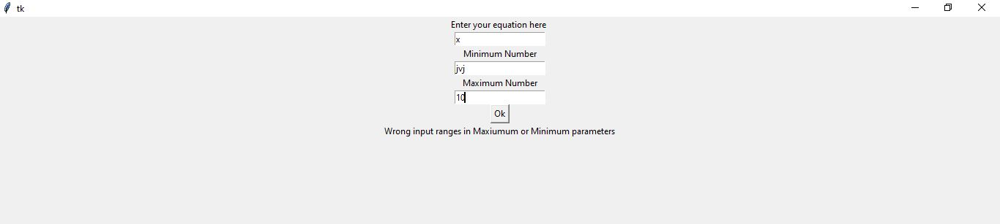

# Equation-Grapher
This Project Plot any Mathematical Equations Provided by User

## Definition

- This project graph any mathematical equations with friendly user interface. the user has to provide the equation and ranges of the graph any missing information the program detect it and give message to the user.

## Examples
- Here are some examples:

-  Here is some wrong input examples:

### Dependencies

#### install this libraries:
- Numpy
- Tkinter
- Matplotlib
